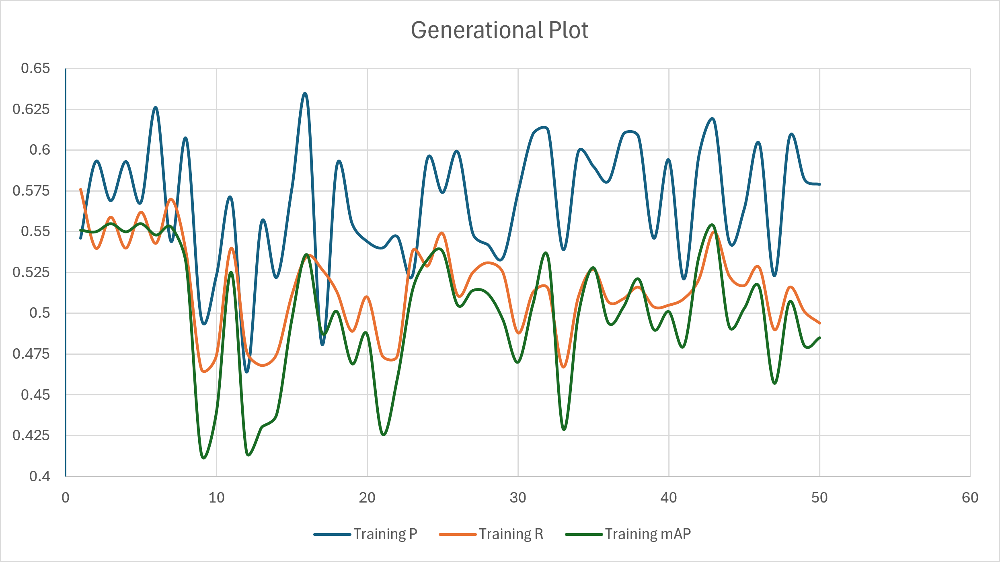
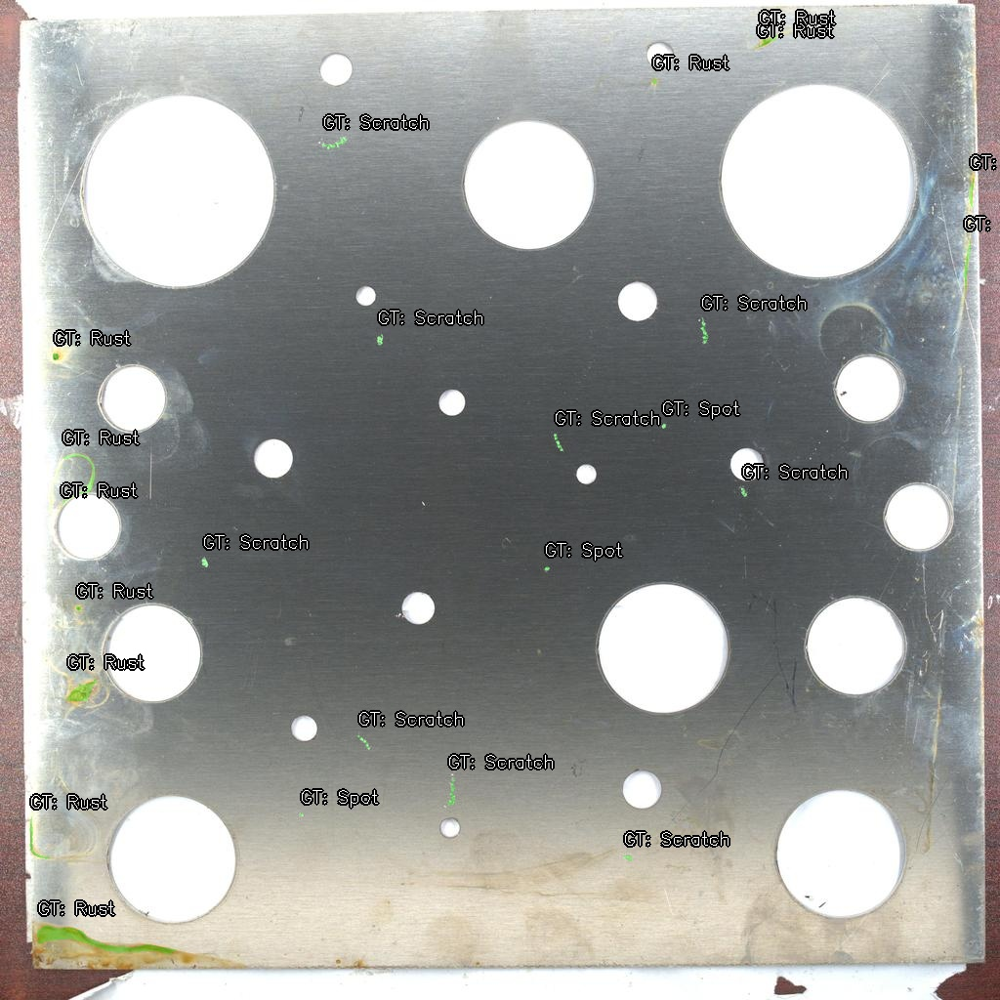
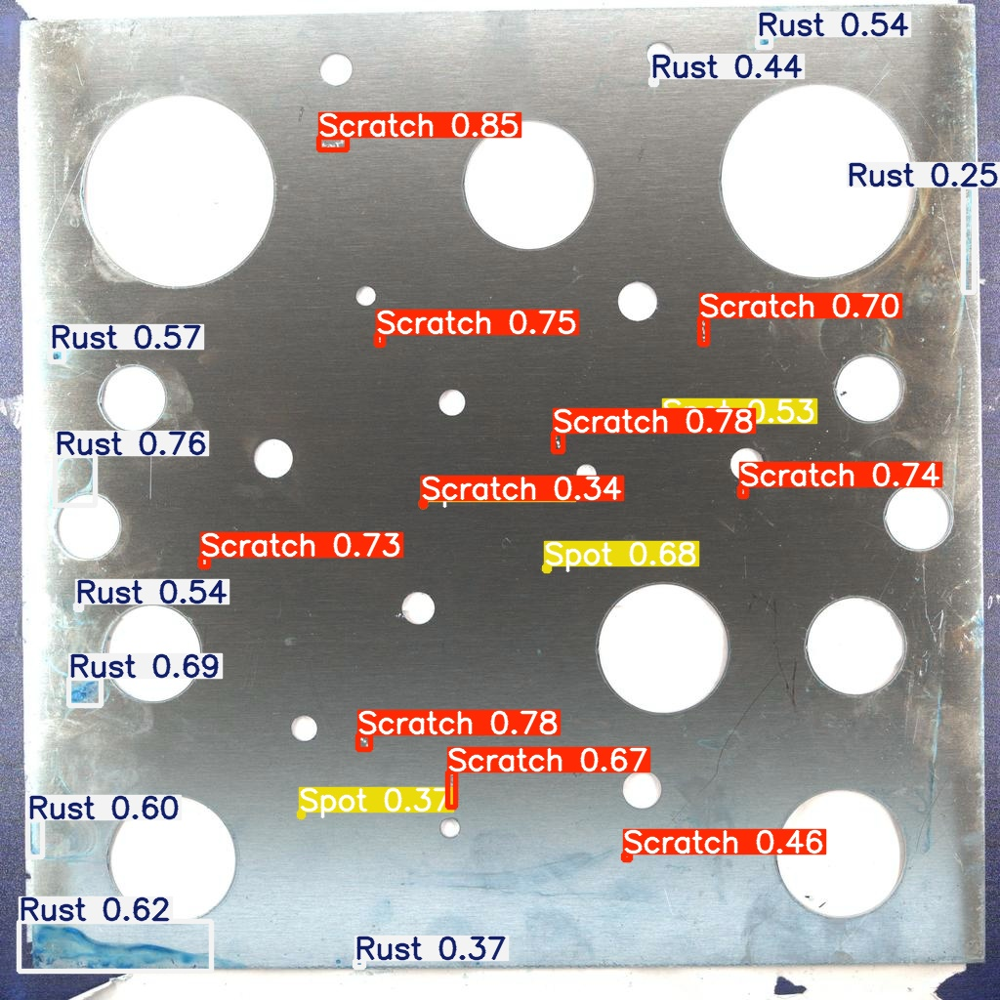

# Automated Surface Defect Detection in Casting using Machine Learning and ROS2 Integrated Simulations

##  Project Overview & Industrial Impact

In modern metal casting and foundry operations, surface defects such as blowholes, cracks, and rust are responsible for a **5-15% rejection rate** in manufactured components. This quality control bottleneck results in significant material waste, increased energy consumption, and operational inefficiencies. Traditional manual inspection is subjective, labor-intensive, and prone to human error—especially when identifying microscopic flaws.

This project addresses these critical challenges by developing a high-performance, real-time automated vision inspection system. A core focus of our research is overcoming the **"Small Object Problem"** present in the Casting Surface Defect Detection (CSDD) dataset, where microscopic flaws often span **as few as 3 pixels** in diameter, making them exceedingly difficult for standard object detection models to capture.

##  Repository Architecture

Our project is structured to ensure a clean separation between data processing, machine learning experimentation, and robotics simulation.

```text
 YOLO-ROS2
 ┣  dataset/                   # Datasets containing ground_truth, images and labels
 ┃ ┣  ground_truth/            # Original bounding boxes
 ┃ ┃ ┣  test/
 ┃ ┃ ┣  train/
 ┃ ┃ ┗  val/
 ┃ ┣  img/                     # Image files
 ┃ ┃ ┣  test/
 ┃ ┃ ┣  train/
 ┃ ┃ ┗  val/
 ┃ ┗  labels/                  # YOLO format label text files
 ┃   ┣  test/
 ┃   ┣  train/
 ┃   ┗  val/
 ┣  kaggle_evolution/          # Hyperparameter evolution folder (can be directly downloaded and run in Kaggle)
 ┃ ┣  img/                     # Image files
 ┃ ┃ ┣  test/
 ┃ ┃ ┣  train/
 ┃ ┃ ┗  val/
 ┃ ┣  labels/                  # YOLO format label text files
 ┃ ┃ ┣  test/
 ┃ ┃ ┣  train/
 ┃ ┃ ┗  val/
 ┃ ┣  csdd.yaml                # Configuration for evolution
 ┃ ┣  hyp.simulation.yaml      # Hyperparameters used for evolution
 ┃ ┗  evolution_script.ipynb   # Code Notebook running genetic algorithm
 ┣ championDNA.yaml            # champion set of hyperparameters found after running GA for 43 generations   
 ┣  kaggle_training/           # Model training folder (can be directly downloaded and run in Kaggle)
 ┃ ┣  img/                     # Image files
 ┃ ┃ ┣  test/
 ┃ ┃ ┣  train/
 ┃ ┃ ┗  val/
 ┃ ┣  labels/                  # YOLO format label text files
 ┃ ┃ ┣  test/
 ┃ ┃ ┣  train/
 ┃ ┃ ┗  val/
 ┃ ┣  csdd.yaml                # Configuration for training
 ┃ ┣  hyp.simulation.yaml      # Hyperparameters used for training
 ┃ ┗  training_script.ipynb    # Code Notebook running the model training
 ┣  analysis.py                # script for analysis and error metrics
 ┣  create_config.py           # script for twisting configs
 ┣  overlaying_gt.py           # script for overlaying given ground truth on the images
 ┣  oversample_rust.py         # script for manual oversampling of the minority class
 ┣  prepare_labels.py          # script for preparing labels for the images
 ┣  resize_script.py           # script for resizing the original images to optimize processing power
 ┣  test_run.py                # script for test running the model on any particular image
 ┗  README.md                  # Project documentation
```

##  Machine Learning Pipeline & 3-Stage Experimentation

To achieve robust defect detection, we structured our model development into a rigorous three-phase experimentation pipeline.

### Phase 1: Baseline Architecture Setup
We initialized our pipeline using the **YOLOv5s** architecture, selected for its optimal balance between speed and accuracy in edge-deployment scenarios.
- **Model Specs:** 157 layers, 7.2M parameters.
- **Inference Speed:** 17.2ms per image (real-time capable).
- **The Challenge:** While the baseline performed reasonably well on larger defects, it exhibited a critical **"blind spot"** for Rust detection. The model achieved a low recall of **0.417** for Rust, with confusion matrices revealing that **50% of rust defects were leaked into the background** (missed detections).

### Phase 2: Manual Experimentation (Ablation Studies)
To mitigate the baseline's shortcomings, we conducted manual ablation studies targeting the minority class (Rust) and the Small Object Problem:
- **Techniques Applied:** Manual Oversampling of minority classes and Asymmetric Weighted Loss Tuning (adjusting `cls_pw` for classification and `obj_pw` for objectness).
- **Outcome:** While recall for specific classes saw minor shifts, manual tuning ultimately **failed to surpass the baseline mean Average Precision (mAP)**, highlighting the complex, non-linear interdependencies of YOLO's hyperparameter space.

### Phase 3: Automated Hyperparameter Evolution (Genetic Algorithm)
Recognizing the limitations of manual tuning, we deployed an automated **Genetic Algorithm (GA)** to evolve hyperparameters over **50 generations**.
- **The Result:** The search yielded a **"Champion DNA"** at Generation 43.
- **Performance Gains:** The champion model successfully re-calibrated the loss landscape, achieving a **2.6% mAP increase for the difficult Rust class** and a **0.78% mAP increase across all classes**, effectively curing the baseline blind spot.

*Fig : Variation of various metrics across generations.*

###  Metrics Comparison

| Model Pipeline | Total Params | Inference Time | Rust Recall | Overall mAP@0.5 | Notes |
| :--- | :--- | :--- | :--- | :--- | :--- |
| **Phase 1: Baseline YOLOv5s** | 7.2M | 17.2ms | 0.417 | Baseline | 50% Rust leakage to background |
| **Phase 2: Manual Tuning** | 7.2M | 17.2ms | Marginal | < Baseline | Asymmetric loss tuning unsuccessful |
| **Phase 3: Champion DNA (Gen 43)** | 7.2M | 17.2ms | **Optimized** | **+0.78%** | **+2.6% mAP** specifically for Rust |

##  Cyber-Physical Interface (Sim2Real Bridge)

Bridging the gap between software and hardware, the optimized "Champion" model was deployed into a **Cyber-Physical System (CPS)**. 

We exported the tuned model as a highly efficient, real-time perception node within a multi-stage **ROS2 and Gazebo** environment. This simulation features a dynamic industrial conveyor belt setup where simulated camera sensors feed real-time frames to the ROS2 perception node. Upon detecting and classifying defects, the system publishes decision logic to automated actuator nodes, successfully demonstrating automated physical sorting and segregation of defective castings in a simulated industrial environment.
|  |  |
| *Fig : Ground Truth Labels* | *Fig : Model Predictions* |

##  Contributors

- **Arnav De** – Machine Learning Pipeline, Data Engineering & Hyperparameter Optimization
- **Arya Kshirsagar** – ROS2/Gazebo Simulation, Sim2Real Integration & CAD Modeling
